# 30.5 🍔

> `30.5`는 **맛집 정보 및 후기 공유 커뮤니티 서비스** 입니다.

 

 　  　　

 

## **📅 일정**

- **2022.11.01 ~ 2022.11.07**

---

## **🧑‍💻 개발팀**

<a href="https://github.com/1c0332zz/Django_PJT_30.5/graphs/contributors">

|                          |     |
| ----------------------------------------------------------------------------------------------- | --- |
| 총괄 팀장: 송강섭 백엔드 및 발표: 주세환 백엔드 총괄 : 김선교 UI/UX 담당: 조병진 |     |

</a>

 

---

## **🎮 주요 기능**

- **회원관리**
  - 회원가입
  - 로그인
  - 회원 프로필
    - 회원 프로필 관리 / 수정
    - **회원간 팔로우 / 팔로잉**
  - 로그아웃
  - 회원탈퇴

---

- **메인 페이지**
  - 헤더 - **검색 창: 태그 및 지역, 이름으로 검색**
  - 메인 - 믿고 보는 맛집 리스트 : 그리드 반응형
  - 메인 - 스토리 : 그리드 반응형
  - 메인 - 평점 높은 인기 식당 : 그리드 반응형
- **네브바**
  - 토글 버튼
  - 검색 기능
- **푸터**
  - 프로젝트 정보 및 팀 정보

---

- **맛집 리스트**
  - 메뉴별 리스트
    - 태그별 분류
  - 식당별 리스트
    - 식당 사진 / 이름 / 주소 / 평점 / 별점 주기 / 댓글 작성자 프로필 및 댓글 내용
- **식당 정보**
  - 사진
  - **조회 수, 리뷰 수, 별점 수**
  - **별점 주기 / 리뷰 쓰기**
  - 식당 정보
  - 리뷰 목록

---

- **리뷰 목록**
  - 리뷰 작성 시간 / 리뷰 내용 / 리뷰 평점 / 작성자 프로필 / 작성자 리뷰 개수
- **리뷰 작성**
  - 리뷰 내용
  - **평점**
  - **사진 추가**
- **리뷰 정보**
  - 리뷰 작성 시간 / 리뷰 내용 / 리뷰 평점 / 작성자 프로필 / 작성자 리뷰 개수
- **리뷰 수정**
- **리뷰 삭제**

---

## **🧩 DB 설계**

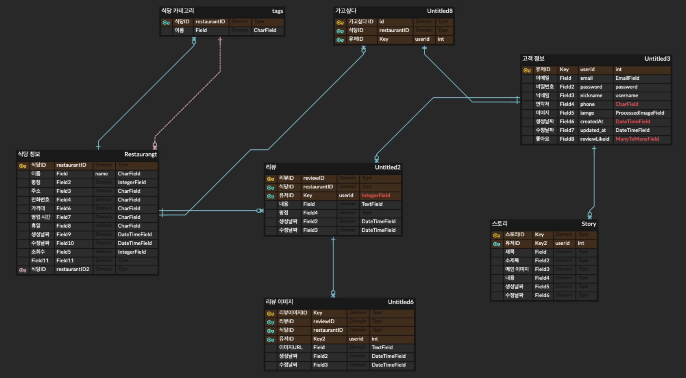

---

## **🍔 서비스 소개**

 

접기/펼치기

### **1. 메인화면**

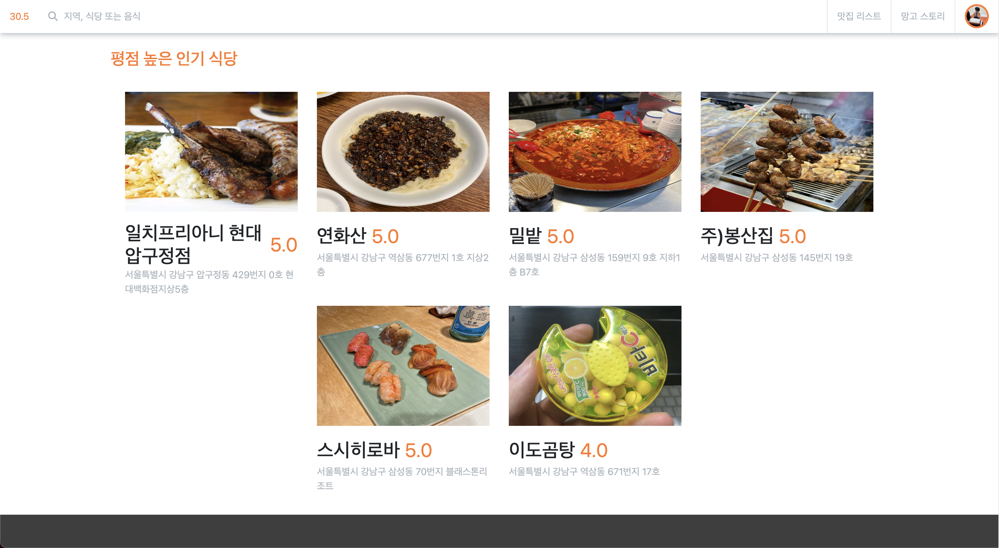

- 메인화면에서는 식당을 찾아볼 수 있도록 `검색창과 베스트 맛집 리스트, 최근 맛집 스토리, 평점이 높은 식당`으로 구성되었습니다.

---

### **2. 맛집 리스트**

#### 2-1. 메뉴별 리스트

- 메뉴별 리스트에서는 베스트 맛집 `카테고리별로 확인`할 수 있습니다.

 

#### 2-2. 식당별 리스트

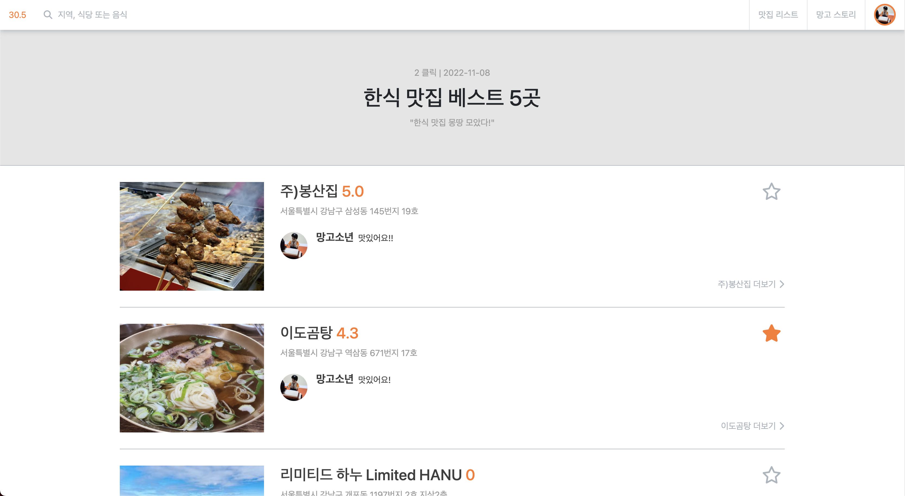

- 식당별 리스트에서는 조회수, 식당 정보, 최근 리뷰 내용과 날짜를 `간략하게 확인`할 수 있습니다.
- `별점(가고싶다) 등록이 가능`합니다.

---

### **3. 식당 정보**

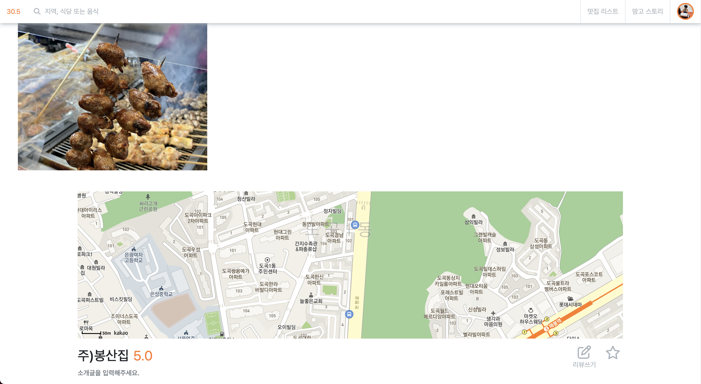
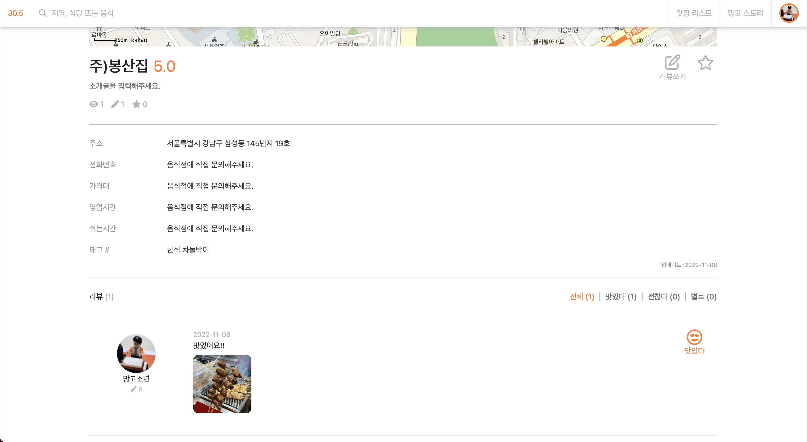

- 식당 위치와 정보, 조회수, 리뷰수, 별점수를 `자세히 확인`할 수 있습니다.
- `리뷰 등록`과 `별점(가고싶다) 등록`이 가능합니다.
- `리뷰 목록`을 확인할 수 있습니다.

---

### **4. 리뷰**

#### 4-1. 리뷰 작성

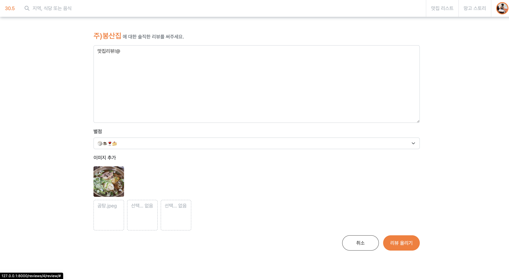

- 리뷰에는 `리뷰 내용과 평점, 사진을 작성`할 수 있습니다.
- `평점은 1~5점까지` 줄 수 있으며, 리뷰 목록에서는 `3점을 기준으로 맛있다, 괜찮다, 별로라는 이모지로 출력`됩니다.

 

#### 4-2. 리뷰 정보

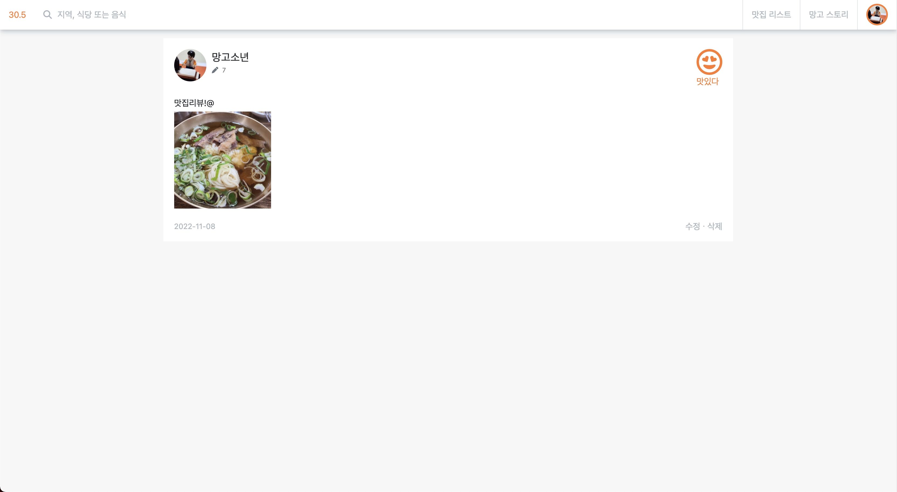

- `본인이 작성한 리뷰에서만 수정, 삭제가 가능`합니다.
- 본인이 작성하지 않았다면 `프로필 사진을 눌러 다른 유저의 프로필로 이동`합니다.

---

### **4. 스토리**

#### 4-1. 스토리 리스트

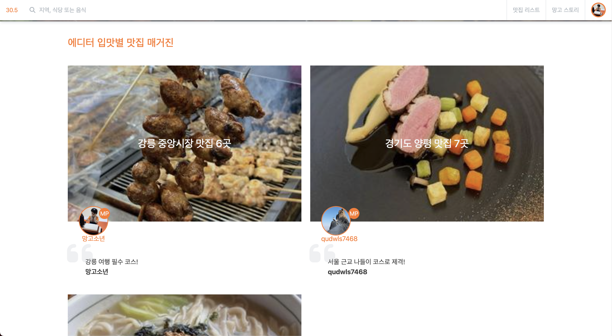

- 스토리는 `권한받은 유저만 사용이 가능`합니다.

 

#### 4-2. 스토리 정보

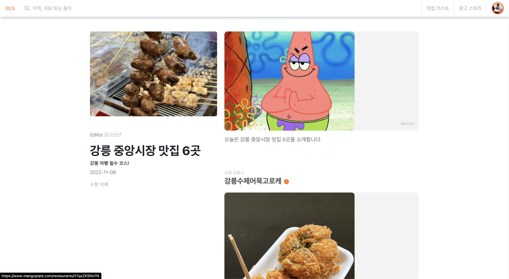
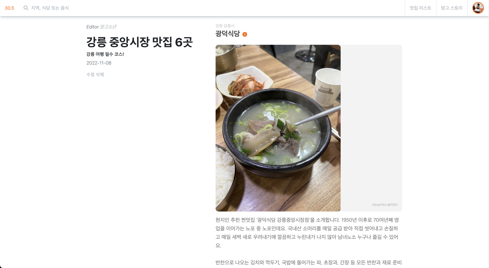
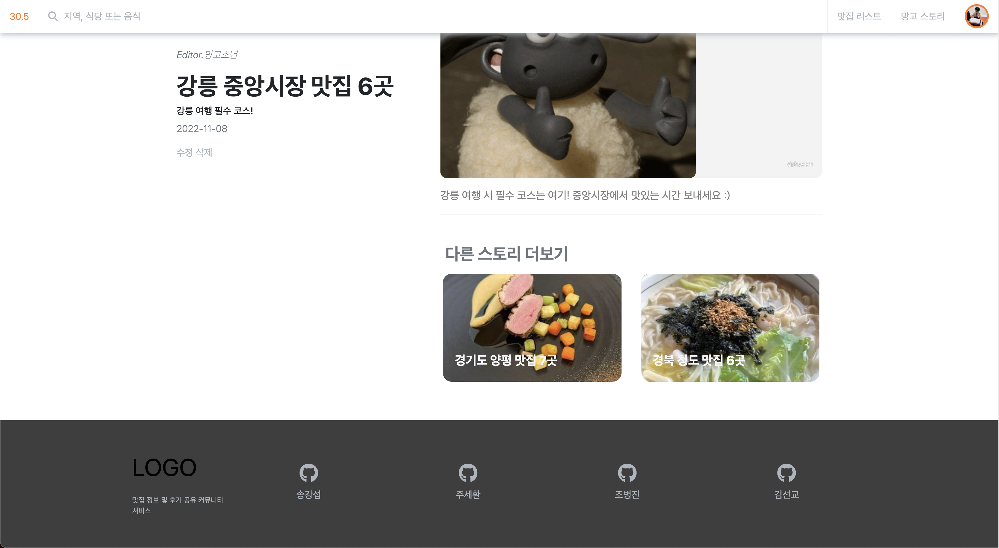

- `summernote 사용`해 스토리 작성시 사진과 텍스트 입력이 가능하도록 하였습니다.
- 긴 글을 보고 난 이후에는 `다른 스토리를 손쉽게 찾아 볼 수 있도록 현재 스토리를 제외한 나머지 최근 스토리`를 볼 수 있게 하였습니다.

---

### **4. 회원**

#### 5-1. 회원 정보

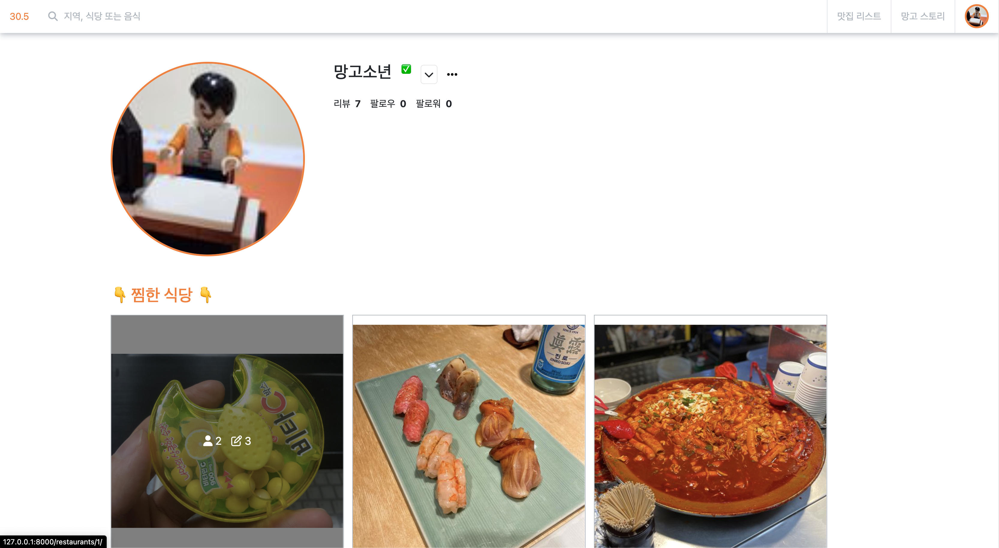
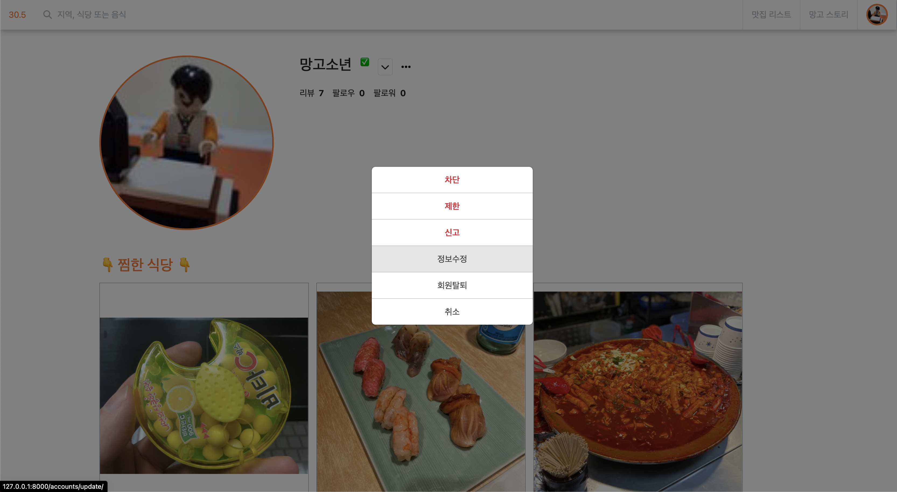

- 회원 정보에서는 `회원이 작성한 리뷰`와 `회원간 팔로우 수를 확인`할 수 있습니다.
- `별점(가고싶다)을 준 식당의 목록을 확인`할 수 있습니다.
- 식당 사진에 마우스를 올리면 `식당에 별점을 준 회원 수와 식당의 리뷰 수를 확인`할 수 있습니다.
- `회원 정보 수정 및 삭제가 가능`합니다.

 

#### 5-2. 회원 간 팔로우

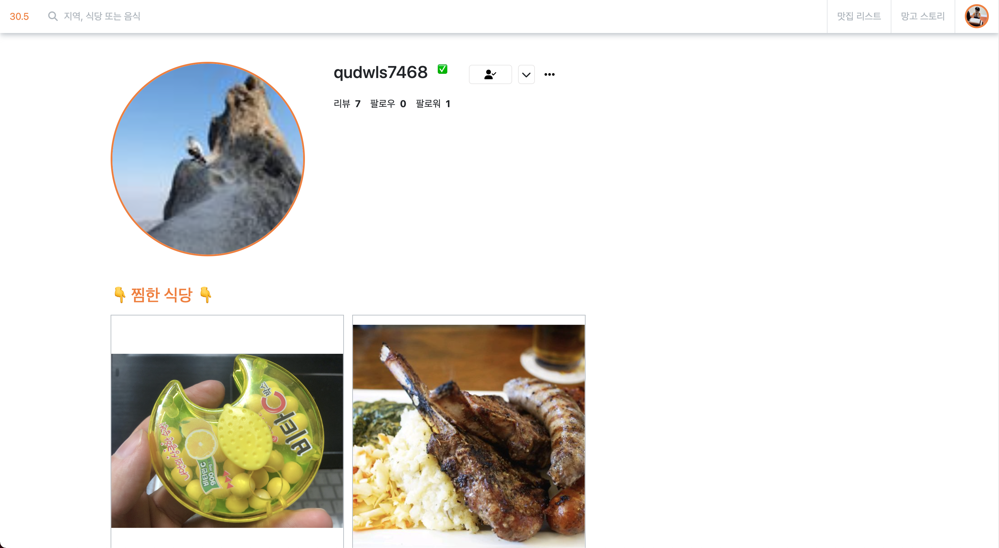

- `회원간 팔로우가 가능`합니다.

---
## 💡KPT

### Keep

* 화면 디자인 부터 기능 설계까지 계획하면서 개발을 구현하는 과정을 통해 프로젝트를 완성하기 까지 시간 분배와 기능 구현을 할 수 있었던 것 같습니다. 
* 팀원 모두 소통하는 자세와 의견을 수용하는 자세로 프로젝트에 임하여 각자의 역할 분담과 이에 맞는 기능 구현을 원활하게 진행할 수 있었습니다.
* 같이 오류 메시지를 보면서 왜 안 되는지 고민했을 때 든든했던 것 같습니다.
* 문제 해결에서 앞서 팀원 간 의사소통은 필수라는 생각이 들었습니다.

### Problem

- 스스로의 실력적 한계를 적나라하게 볼 수 있었던 시간이었습니다.
- 기간이 짧아 많은 기능을 도전해보지 못했다
- 기능 구현 / 식당 디테일 사진 회전목마

### Try

- 서로 소통해서 문제를 어떻게 해결하는게 가장 깔끔할 지 협력했다.
- 코딩을 잘한다는 것은 얼마나 코드를 잘 읽고 검색해서 활용하냐 인 것 같다👍

---

## 🎉소감

- 일단 팀원들에게 감사합니다. 많이 부족했는데 화 한번 안내고 너무 잘 도와 줬습니다.
- 많이 배웠고 평소 궁금하던 것들을 같은 입장에서 물어볼 수 있어서 좋았습니다.
- 혼자 공부하며 어려웠던 부분을 팀원과 같이 하면서 많이 배웠습니다.
- 소통 뿐만 아니라, 프로젝트에 참여하는 자세를 배울 수 있었습니다.

